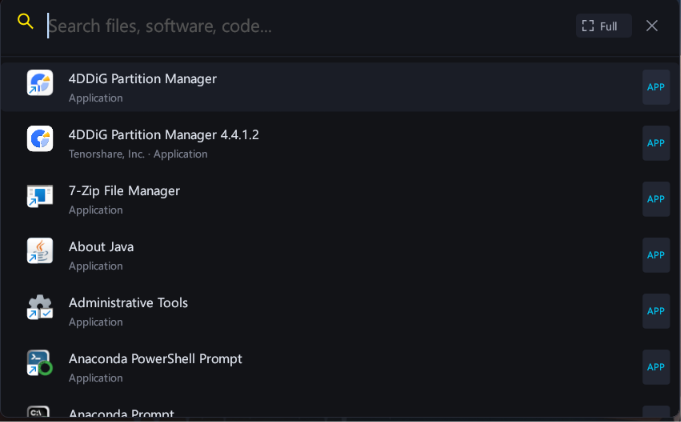
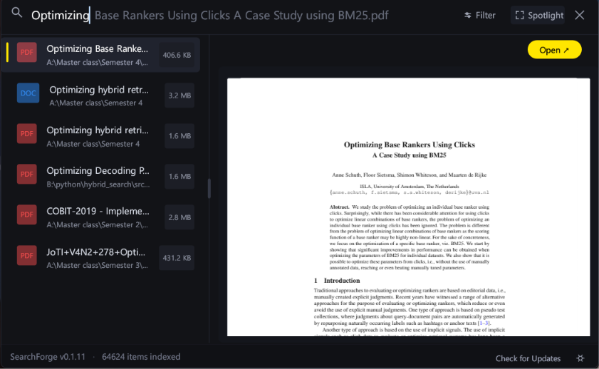

<p align="center">
  
</p>
<p align="center">
  
</p>


<h1 align="center">SearchForge</h1>

<p align="center">
  A fast, lightweight, native desktop search engine for your entire machine.
</p>

<p align="center">
  Built with Rust and egui for speed, responsiveness, and a clean native experience.
</p>

---

## Overview

**SearchForge** is a high-performance local search application designed to make finding files, documents, code, images, PDFs, folders, and installed applications fast and effortless.

Instead of navigating through Windows Explorer and remembering where something was stored, SearchForge gives you one place to search your machine.

Search:

```text
terminal
vscode
software architecture
git
dbeaver
```

and quickly discover the relevant application or file.

The project is designed around one core principle:

> **Search everything. Find it fast. Get out of the way.**

---

## ✨ Features

### 🔎 Whole-Machine Search

Search across indexed locations on your machine without manually browsing folders.

SearchForge can discover:

- Files
- Folders
- Documents
- Source code
- Markdown
- PDFs
- Images
- Configuration files
- Installed applications
- Windows application shortcuts and packaged applications

The indexing system is designed to run in the background so the UI remains responsive.

### 🖥️ Application Discovery

Applications are treated as first-class search results rather than ordinary files.

Search for:

```text
vscode
sublime
netbeans
dbeaver
terminal
```

and SearchForge can present the application with:

- Application name
- Real application icon
- Publisher
- Application type
- Installation/location information
- Launch action

The goal is to make SearchForge feel like a powerful application launcher as well as a file search engine.

### 📄 Rich File Preview

SearchForge provides specialized previews depending on the selected item.

Supported preview concepts include:

- Plain text
- Markdown
- Source code
- JSON/YAML/TOML
- Images
- PDF documents
- Applications

Text and Markdown documents are displayed in a scrollable preview so the entire document remains accessible.

### 📚 Lightweight PDF Rendering

PDF files are rendered as actual PDF pages rather than being incorrectly interpreted as raw text.

The PDF experience is intentionally minimal:

- Real page rendering
- Natural vertical scrolling
- Lazy page rendering
- Page caching
- No unnecessary PDF-reader sidebar
- No heavy toolbar
- External opening when required

The goal is simple:

> Chrome-quality PDF rendering with SearchForge's minimal UI.

### ⚡ Performance First

SearchForge is designed as a native Rust application.

Performance priorities include:

- Background indexing
- Responsive UI
- Cached metadata
- Cached application icons
- Lazy PDF rendering
- Efficient search
- Minimal unnecessary allocations
- No heavyweight web UI

The interface should remain responsive while indexing and previewing content.

### 🎛️ Exclusion Filters

Exclude directories and patterns that should not participate in indexing.

Default exclusions can include locations such as:

```text
node_modules
.git
target
AppData
.cache
$RECYCLE.BIN
```

Custom exclusion patterns can also be added.

### 🌙 Minimal Native UI

SearchForge intentionally avoids excessive UI chrome.

The design focuses on:

- Clear hierarchy
- Lightweight hover states
- Subtle selection indicators
- Clean typography
- Minimal borders
- Restrained accent colors
- Useful whitespace
- Native desktop behavior

The goal is a utility that feels fast and disappears into the workflow.

---

## 🧭 How It Works

At a high level:

```text
                  ┌──────────────────┐
                  │   File System    │
                  └────────┬─────────┘
                           │
                           ▼
                  ┌──────────────────┐
                  │ Background       │
                  │ Indexer          │
                  └────────┬─────────┘
                           │
                           ▼
                  ┌──────────────────┐
                  │ Search Index     │
                  │ SQLite           │
                  └────────┬─────────┘
                           │
                           ▼
┌───────────────┐   ┌──────────────────┐
│ Search Query  │──▶│ Search + Ranking │
└───────────────┘   └────────┬─────────┘
                              │
                              ▼
                     ┌────────────────┐
                     │ Search Results │
                     └───────┬────────┘
                             │
                             ▼
                     ┌────────────────┐
                     │ Smart Preview  │
                     └────────────────┘
```

The architecture separates indexing, searching, and presentation so expensive work does not block the UI.

---

## 🛠️ Technology

SearchForge is built with a deliberately lightweight native stack.

| Technology | Purpose |
|---|---|
| **Rust** | Core application and performance |
| **eframe / egui** | Native desktop UI |
| **SQLite / rusqlite** | Search/index database |
| **walkdir** | Filesystem traversal |
| **dirs** | User directory discovery |
| **open** | Native external application/file opening |
| **unicode-segmentation** | Unicode-aware text handling |

Additional dependencies may be introduced when they provide a clear benefit without unnecessarily increasing application complexity.

---

## 🚀 Getting Started

### Requirements

- Rust toolchain
- Cargo
- Windows for the primary Windows application-discovery functionality

Install Rust from the official Rust website:

https://www.rust-lang.org/tools/install

### Clone

```bash
git clone <repository-url>
cd searchforge
```

### Run

```bash
cargo run --release
```

For development:

```bash
cargo run
```

### Build

```bash
cargo build --release
```

The optimized executable will be generated under:

```text
target/release/
```

---

## 🧪 Development

Before submitting changes, run:

```bash
cargo check
cargo test
cargo clippy
```

For a release build:

```bash
cargo build --release
```

Performance-sensitive changes should also be tested with a realistic machine index rather than only a small development directory.

---

## 📁 Project Philosophy

SearchForge follows a few simple engineering principles.

### 1. Native First

SearchForge is a native Rust desktop application.

Avoid introducing a web stack when native functionality is sufficient.

### 2. Responsive UI

The UI must remain responsive while:

- indexing
- searching
- reading metadata
- rendering previews
- extracting application icons

### 3. Correct Specialized Previews

A PDF is not a text file.

An application is not an ordinary file.

An image is not raw binary data.

Preview behavior should respect the actual type of the selected item.

### 4. Lightweight UX

Every visual element should have a purpose.

Avoid unnecessary:

- borders
- animations
- shadows
- dialogs
- toolbars
- decorative UI

### 5. Search First

SearchForge exists to reduce the distance between:

```text
"I need something"
```

and:

```text
"Here it is."
```

---

## 🗺️ Roadmap

The roadmap is intentionally focused on search quality rather than feature bloat.

### Current

- [x] Whole-machine indexing
- [x] Fast local search
- [x] File and folder discovery
- [x] Application discovery
- [x] Application launching
- [x] Application icons
- [x] PDF preview
- [x] Image preview
- [x] Text preview
- [x] Markdown preview
- [x] Exclusion filters
- [x] Native external opening
- [x] Lightweight dark UI

### Next

- [ ] Better application ranking
- [ ] Fuzzy search improvements
- [ ] Content/full-text search
- [ ] Search snippets
- [ ] Match highlighting
- [ ] Search operators
- [ ] Metadata filters
- [ ] Recent searches
- [ ] More keyboard-first workflows
- [ ] Improved Windows application metadata
- [ ] Incremental index updates

### Future

Potential future capabilities include:

- Semantic/local intelligent search
- Related-file discovery
- More advanced content indexing
- Cross-platform application discovery
- Advanced search ranking
- Global keyboard launcher mode

Features will be evaluated based on whether they make SearchForge **faster and more useful**, rather than simply making it bigger.

---

## 🔐 Privacy

SearchForge is designed as a **local-first search application**.

Your indexed filesystem metadata is intended to remain on your machine.

SearchForge does not need to upload your files to a remote server to perform local search.

If future versions introduce optional online or AI-powered capabilities, those features should be clearly separated and explicitly documented.

---

## 🤝 Contributing

Contributions, bug reports, performance improvements, and UX ideas are welcome.

When contributing:

1. Keep changes focused.
2. Avoid unnecessary dependencies.
3. Preserve UI responsiveness.
4. Avoid blocking the main UI thread.
5. Add tests where practical.
6. Run:

```bash
cargo check
cargo test
cargo clippy
```

before submitting a change.

For performance-related changes, explain the expected performance impact.

---

## 📜 License

SearchForge is released under the **MIT License**.

See [`LICENSE`](LICENSE) for the complete license text.

Copyright (c) 2026 SearchForge contributors.

---

## ⭐ Why SearchForge?

There are many ways to search a computer.

SearchForge is built around a simpler idea:

**one search box for your entire machine.**

Files.

Documents.

Code.

PDFs.

Images.

Applications.

Everything in one fast, native interface.

---

<p align="center">
  <strong>Search less. Find more.</strong>
</p>
"""

license_text = """MIT License

Copyright (c) 2026 SearchForge contributors

Permission is hereby granted, free of charge, to any person obtaining a copy
of this software and associated documentation files (the "Software"), to deal
in the Software without restriction, including without limitation the rights
to use, copy, modify, merge, publish, distribute, sublicense, and/or sell
copies of the Software, and to permit persons to whom the Software is
furnished to do so, subject to the following conditions:

The above copyright notice and this permission notice shall be included in all
copies or substantial portions of the Software.

THE SOFTWARE IS PROVIDED "AS IS", WITHOUT WARRANTY OF ANY KIND, EXPRESS OR
IMPLIED, INCLUDING BUT NOT LIMITED TO THE WARRANTIES OF MERCHANTABILITY,
FITNESS FOR A PARTICULAR PURPOSE AND NONINFRINGEMENT. IN NO EVENT SHALL THE
AUTHORS OR COPYRIGHT HOLDERS BE LIABLE FOR ANY CLAIM, DAMAGES OR OTHER
LIABILITY, WHETHER IN AN ACTION OF CONTRACT, TORT OR OTHERWISE, ARISING FROM,
OUT OF OR IN CONNECTION WITH THE SOFTWARE OR THE USE OR OTHER DEALINGS IN THE
SOFTWARE.
"""

out = Path("/mnt/data")
readme_path = out / "README.md"
license_path = out / "LICENSE"

# pypandoc is required for generated Markdown/text files.
pypandoc.convert_text(readme, "md", format="md", outputfile=str(readme_path),
                      extra_args=["--standalone"])
pypandoc.convert_text(license_text, "plain", format="md", outputfile=str(license_path),
                      extra_args=["--standalone"])

print(f"Created: {readme_path}")
print(f"Created: {license_path}")
